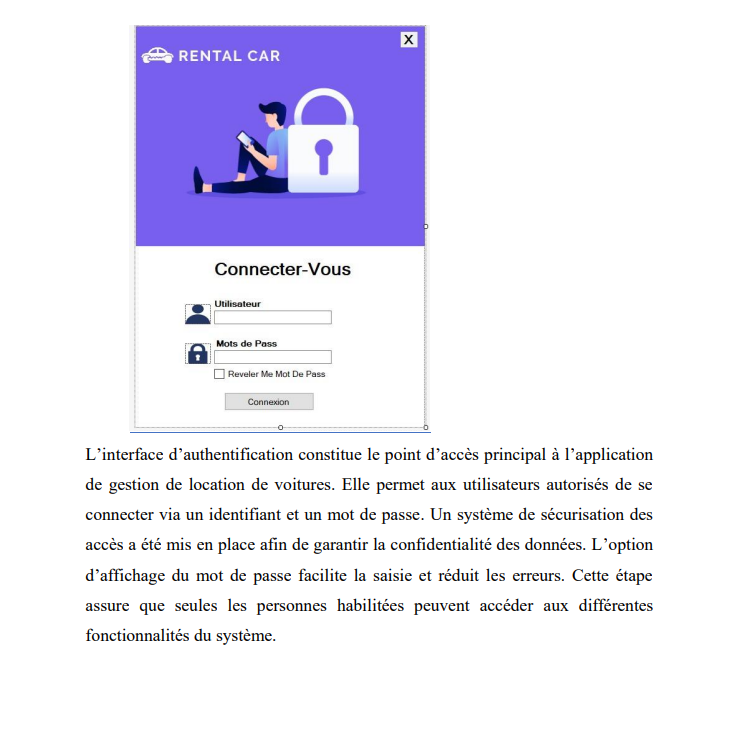
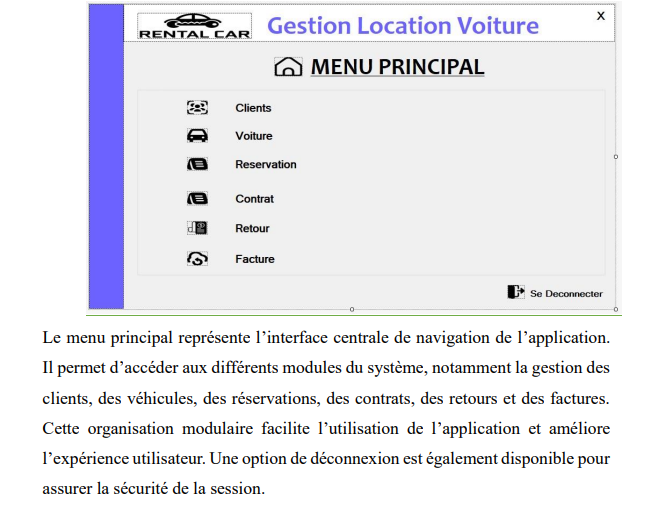
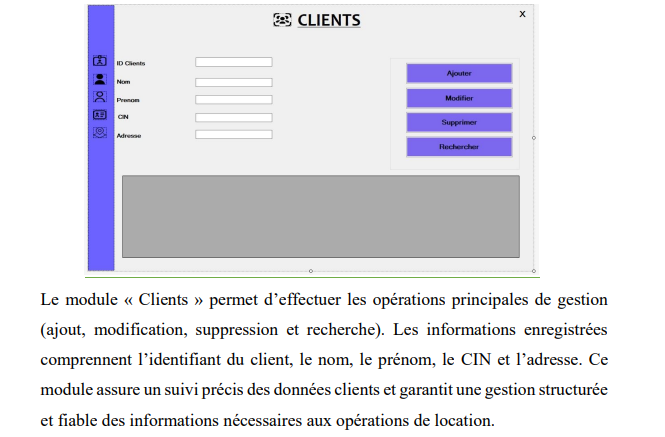
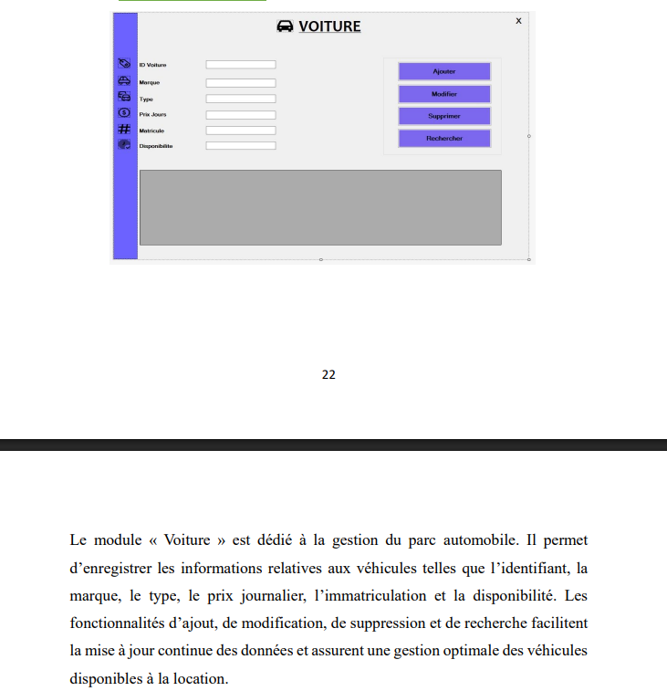
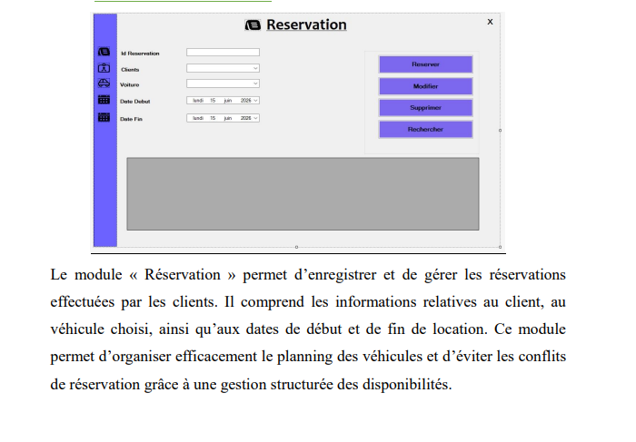
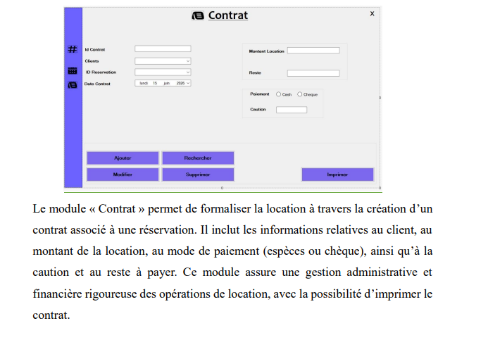
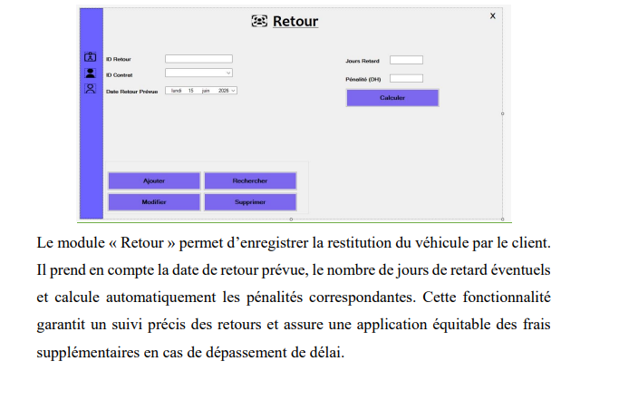

# Application-de-Gestion-de-Location-de-Voitures
Le code source complet n'est pas disponible publiquement.
Pour obtenir le projet ou discuter d'une collaboration, contactez-moi directement sur WhatsApp.
+212 0781506265

## 📸 Aperçu de l'application

### 🔐 Interface de connexion
Cette interface permet à l'utilisateur de se connecter à l'application de manière sécurisée.

---

### 🏠 Tableau de bord
Le tableau de bord permet d'avoir une vue globale sur l'activité de l'application et d'accéder rapidement aux différentes fonctionnalités.

---

### 👤 Gestion des clients
Cette interface permet d'ajouter, modifier, supprimer et consulter les informations des clients.

---

### 🚗 Gestion des véhicules
Cette interface permet de gérer les véhicules disponibles, leurs informations, leur état et leur disponibilité.

---

### 📅 Gestion des réservations
Cette interface permet de créer et gérer les réservations des véhicules selon les besoins des clients.

---

### 📄 Gestion des contrats
Cette interface permet de créer et consulter les contrats de location associés aux réservations.

---

### 💰 Gestion des factures
Cette interface permet de gérer les factures liées aux locations et de suivre les paiements.

---

### 🔄 Gestion des retours
Cette interface permet d'enregistrer le retour d'un véhicule et de mettre à jour son état et sa disponibilité.

